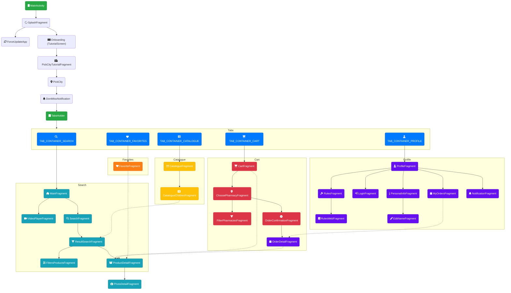

```mermaid
flowchart TD
    %% Основная структура
    MA("fa:fa-mobile MainActivity") --> SF("fa:fa-spinner SplashFragment")
    SF --> UP("fa:fa-refresh ForceUpdateApp")
    SF --> ONB("fa:fa-book-open Onboarding (TutorialScreen)")
    ONB --> PCT("fa:fa-city PickCityTutorialFragment")
    PCT --> PC("fa:fa-map-marker-alt PickCity")
    PC --> DMN("fa:fa-bell DontMissNotification")
    DMN --> TH("fa:fa-tablet TabsHolder")
    TH --> Tabs

    subgraph Tabs
        direction LR
        ST("fa:fa-search TAB_CONTAINER_SEARCH")
        CT("fa:fa-th-list TAB_CONTAINER_CATALOGUE")
        CT2("fa:fa-shopping-cart TAB_CONTAINER_CART")
        FT("fa:fa-heart TAB_CONTAINER_FAVORITES")
        PT("fa:fa-user TAB_CONTAINER_PROFILE")
    end

    %% Поиск
    subgraph Search
        direction TB
        ST --> MF("fa:fa-home MainFragment")
        MF --> VPF("fa:fa-video VideoPlayerFragment")
        MF --> SF2("fa:fa-search SearchFragment")
        SF2 --> RSF("fa:fa-filter ResultSearchFragment")
        RSF --> FP("fa:fa-sliders FiltersProductsFragment")
        RSF --> PD("fa:fa-box-open ProductDetailFragment")
    end

    %% Каталог
    subgraph Catalogue
        direction TB
        CT --> CF("fa:fa-list CatalogueFragment")
        CF --> CCF("fa:fa-list-alt CatalogueChildrenFragment")
        CCF -.-> RSF
    end

    %% Корзина
    subgraph Cart
        direction TB
        CT2 --> CF2("fa:fa-shopping-cart CartFragment")
        CF2 -.-> PD
        CF2 --> CPF("fa:fa-map-marker-alt ChoosePharmacyFragment")
        CPF --> FPF("fa:fa-filter FilterPharmaciesFragment")
        CPF --> OCF("fa:fa-check-circle OrderConfirmationFragment")
        OCF --> ODF("fa:fa-box OrderDetailFragment")
        ODF -.-> PD
    end

    %% Избранное
    subgraph Favorites
        direction TB
        FT --> FF("fa:fa-heart FavoriteFragment")
        FF -.-> PD
    end

    %% Профиль
    subgraph Profile
        direction TB
        PT --> PF("fa:fa-user ProfileFragment")
        PF --> RF("fa:fa-gavel RulesFragment")
        PF --> LF("fa:fa-sign-in LoginFragment")
        PF --> MOF("fa:fa-box MyOrdersFragment")
        PF --> PIF("fa:fa-info PersonalInfoFragment")
        PF --> NF("fa:fa-bell NotificationFragment")
        RF --> RWF("fa:fa-book RulesWebFragment")
        PIF --> ENF("fa:fa-pencil-alt EditNameFragment")
        MOF -.-> ODF
    end

    PD --> PHT("fa:fa-camera PhotoDetailFragment")

    %% Стили
    classDef tabStyle color:#FFFFFF,fill:#007BFF,stroke:#0056b3
    classDef mainStyle color:#FFFFFF,fill:#28A745,stroke:#1E7E34
    classDef searchStyle color:#FFFFFF,fill:#17A2B8,stroke:#117A8B
    classDef catalogueStyle color:#FFFFFF,fill:#FFC107,stroke:#D39E00
    classDef cartStyle color:#FFFFFF,fill:#DC3545,stroke:#C82333
    classDef favoritesStyle color:#FFFFFF,fill:#FD7E14,stroke:#E4601D
    classDef profileStyle color:#FFFFFF,fill:#6610F2,stroke:#520DC2

    class ST,CT,CT2,FT,PT tabStyle
    class MA,TH mainStyle
    class MF,VPF,SF2,RSF,FP,PD,PHT searchStyle
    class CF,CCF catalogueStyle
    class CF2,CPF,FPF,OCF cartStyle
    class FF favoritesStyle
    class PF,MOF,RF,LF,PIF,NF,RWF,ENF,ODF profileStyle
```
