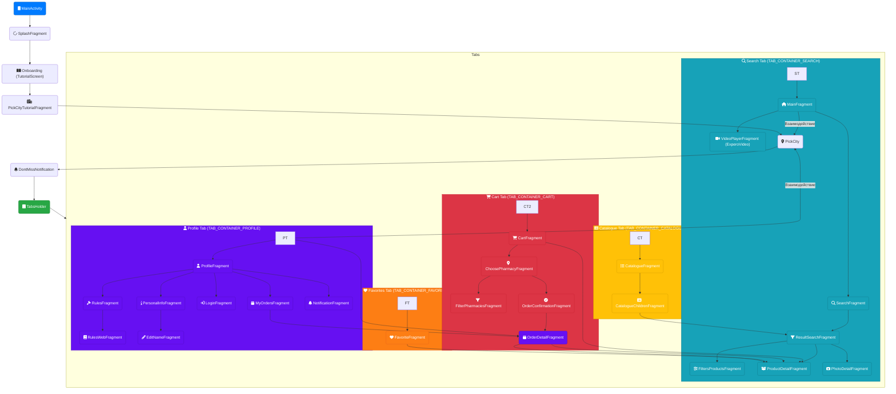

```mermaid
flowchart TD
    subgraph Tabs["Tabs"]
        direction LR
        subgraph ST_Container["fa:fa-search Search Tab (TAB_CONTAINER_SEARCH)"]
            ST --> MF("fa:fa-home MainFragment")
            MF --> VPF("fa:fa-video VideoPlayerFragment (ExperoVideo)") & SF2("fa:fa-search SearchFragment")
            SF2 --> RSF("fa:fa-filter ResultSearchFragment")
            RSF --> FP("fa:fa-sliders FiltersProductsFragment") & PD("fa:fa-box-open ProductDetailFragment") & PHT("fa:fa-camera PhotoDetailFragment")
            MF -->|Взаимодействие| PC
        end
        subgraph CT_Container["fa:fa-th-list Catalogue Tab (TAB_CONTAINER_CATALOGUE)"]
            CT --> CF("fa:fa-list CatalogueFragment")
            CF --> CCF("fa:fa-list-alt CatalogueChildrenFragment")
            CCF --> RSF
        end
        subgraph CT2_Container["fa:fa-shopping-cart Cart Tab (TAB_CONTAINER_CART)"]
            CT2 --> CF2("fa:fa-shopping-cart CartFragment")
            CF2 --> PD & CPF("fa:fa-map-marker-alt ChoosePharmacyFragment")
            CPF --> FPF("fa:fa-filter FilterPharmaciesFragment") & OCF("fa:fa-check-circle OrderConfirmationFragment")
            OCF --> ODF("fa:fa-box OrderDetailFragment")
            ODF --> PD
        end
        subgraph FT_Container["fa:fa-heart Favorites Tab (TAB_CONTAINER_FAVORITES)"]
            FT --> FF("fa:fa-heart FavoriteFragment")
            FF --> PD
        end
        subgraph PT_Container["fa:fa-user Profile Tab (TAB_CONTAINER_PROFILE)"]
            PT --> PF("fa:fa-user ProfileFragment") & ODF("fa:fa-box OrderDetailFragment")
            PT -->|Взаимодействие| PC
            ODF --> PD
            MOF("fa:fa-box MyOrdersFragment") --> ODF
            PF --> RF("fa:fa-gavel RulesFragment") & LF("fa:fa-sign-in LoginFragment") & MOF & PIF("fa:fa-info PersonalInfoFragment") & NF("fa:fa-bell NotificationFragment")
            RF --> RWF("fa:fa-book RulesWebFragment")
            PIF --> ENF("fa:fa-pencil-alt EditNameFragment")
        end
    end

    MA("fa:fa-mobile MainActivity") --> SF("fa:fa-spinner SplashFragment")
    SF --> ONB("fa:fa-book-open Onboarding (TutorialScreen)")
    ONB --> PCT("fa:fa-city PickCityTutorialFragment")
    PCT --> PC("fa:fa-map-marker-alt PickCity")
    PC --> DMN("fa:fa-bell DontMissNotification")
    DMN --> TH("fa:fa-tablet TabsHolder")
    TH --> Tabs

    style ST_Container color:#FFFFFF, fill:#17A2B8, stroke:#117A8B
    style CT_Container color:#FFFFFF, fill:#FFC107, stroke:#D39E00
    style CT2_Container color:#FFFFFF, fill:#DC3545, stroke:#C82333
    style FT_Container color:#FFFFFF, fill:#FD7E14, stroke:#E4601D
    style PT_Container color:#FFFFFF, fill:#6610F2, stroke:#520DC2
    style MA color:#FFFFFF, fill:#007BFF, stroke:#0056b3
    style TH color:#FFFFFF, fill:#28A745, stroke:#1E7E34
    style MF color:#FFFFFF, fill:#17A2B8, stroke:#117A8B
    style VPF color:#FFFFFF, fill:#17A2B8, stroke:#117A8B
    style SF2 color:#FFFFFF, fill:#17A2B8, stroke:#117A8B
    style RSF color:#FFFFFF, fill:#17A2B8, stroke:#117A8B
    style FP color:#FFFFFF, fill:#17A2B8, stroke:#117A8B
    style PD color:#FFFFFF, fill:#17A2B8, stroke:#117A8B
    style PHT color:#FFFFFF, fill:#17A2B8, stroke:#117A8B
    style CF color:#FFFFFF, fill:#FFC107, stroke:#D39E00
    style CCF color:#FFFFFF, fill:#FFC107, stroke:#D39E00
    style CF2 color:#FFFFFF, fill:#DC3545, stroke:#C82333
    style CPF color:#FFFFFF, fill:#DC3545, stroke:#C82333
    style FPF color:#FFFFFF, fill:#DC3545, stroke:#C82333
    style OCF color:#FFFFFF, fill:#DC3545, stroke:#C82333
    style ODF color:#FFFFFF, fill:#6610F2, stroke:#520DC2
    style FF color:#FFFFFF, fill:#FD7E14, stroke:#E4601D
    style PF color:#FFFFFF, fill:#6610F2, stroke:#520DC2
    style MOF color:#FFFFFF, fill:#6610F2, stroke:#520DC2
    style RF color:#FFFFFF, fill:#6610F2, stroke:#520DC2
    style LF color:#FFFFFF, fill:#6610F2, stroke:#520DC2
    style PIF color:#FFFFFF, fill:#6610F2, stroke:#520DC2
    style NF color:#FFFFFF, fill:#6610F2, stroke:#520DC2
    style RWF color:#FFFFFF, fill:#6610F2, stroke:#520DC2
    style ENF color:#FFFFFF, fill:#6610F2, stroke:#520DC2
```
